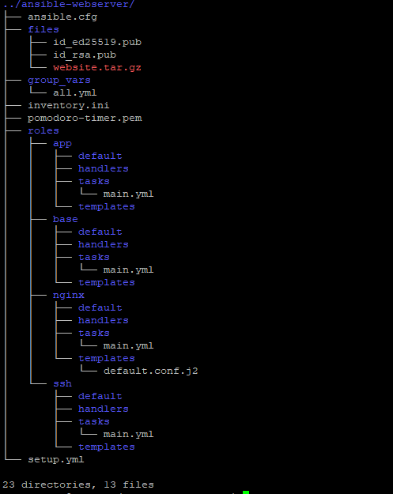
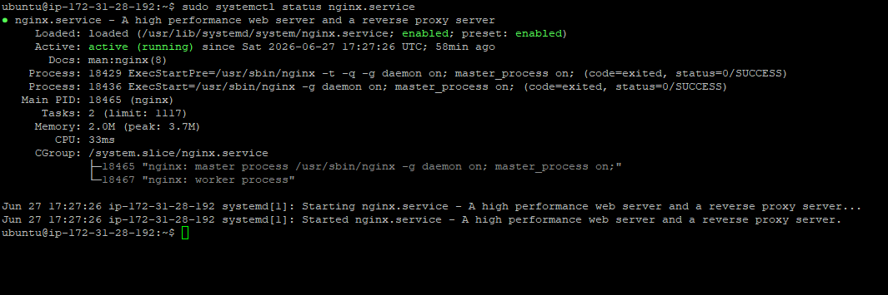
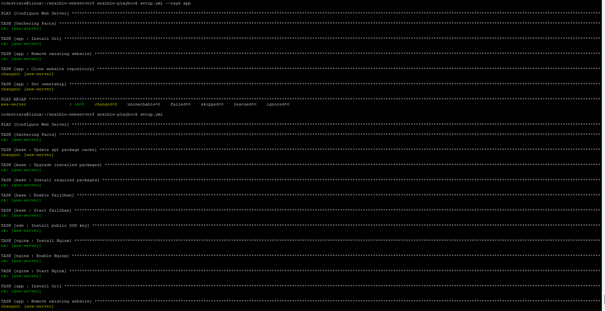
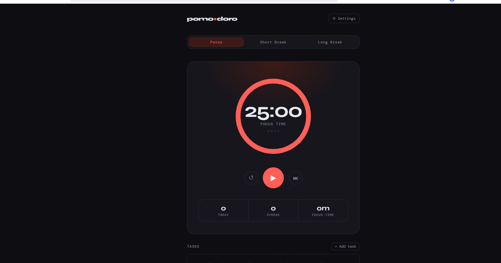

# 🚀 Ansible Web Server Automation


---

## 📖 Project Overview

This project automates the provisioning and deployment of a web server on an **AWS EC2 Ubuntu instance** using **Ansible**.

It follows Ansible best practices by organizing the automation into reusable **roles**, using **variables**, **tags**, **inventory**, and **idempotent playbooks**.

The automation performs the following tasks:

- Performs basic server provisioning
- Installs essential Linux utilities
- Configures Fail2Ban
- Configures SSH public key authentication
- Installs and starts Nginx
- Deploys a static website from GitHub
- Uses modular Ansible roles
- Supports role-based execution using tags

This project was completed as part of the **roadmap.sh DevOps Projects**.

---

# 🏗 Architecture

```
                Ubuntu Control Node
              (Ansible Installed)
                       │
                 SSH Connection
                       │
                       ▼
             AWS EC2 Ubuntu Server
                       │
        ┌──────────────┼──────────────┐
        │              │              │
     Base Role      SSH Role      Nginx Role
                                       │
                                       ▼
                                 App Role
                                       │
                                       ▼
                            Static Website Deployment
```

---

# ✨ Features

- ✅ Infrastructure as Code (IaC)
- ✅ Modular Ansible Roles
- ✅ Inventory Management
- ✅ SSH Key Management
- ✅ Server Provisioning
- ✅ Automatic Package Installation
- ✅ Fail2Ban Installation
- ✅ Nginx Installation
- ✅ Website Deployment
- ✅ GitHub Repository Deployment
- ✅ Variables using `group_vars`
- ✅ Role Tags
- ✅ Idempotent Playbooks
- ✅ AWS EC2 Deployment

---

---

# 🛠 Technologies Used

- Ansible
- Ubuntu Server
- AWS EC2
- Nginx
- Git
- GitHub
- SSH
- Linux

---

# 📦 Roles

## 1️⃣ Base Role

Responsible for provisioning the server.

### Tasks

- Update package cache
- Upgrade packages
- Install

```
curl
wget
git
vim
htop
unzip
fail2ban
```

- Enable Fail2Ban
- Start Fail2Ban

---

## 2️⃣ SSH Role

Responsible for configuring SSH authentication.

### Tasks

- Add public SSH key
- Configure authorized_keys

---

## 3️⃣ Nginx Role

Responsible for configuring the web server.

### Tasks

- Install Nginx
- Enable Nginx
- Start Nginx

---

## 4️⃣ App Role

Responsible for deploying the application.

### Tasks

- Install Git
- Clone GitHub Repository
- Deploy website
- Configure ownership

---

# 📋 Prerequisites

Before running the project ensure you have

- Ubuntu/Linux Machine
- Ansible Installed
- AWS Account
- EC2 Ubuntu Instance
- SSH Key Pair
- Git Installed

---

# ⚙️ Configuration

## Inventory

```ini
[webservers]

aws-server ansible_host=<EC2_PUBLIC_IP> ansible_user=ubuntu ansible_ssh_private_key_file=./pomodoro-timer.pem
```

---

## Variables

Located inside

```
group_vars/all.yml
```

```yaml
website_repo: "https://github.com/sumit0920/pomodoro-timer.git"
website_branch: "main"

web_root: "/var/www/html"

web_user: "www-data"

web_group: "www-data"

ssh_user: "ubuntu"

nginx_service: "nginx"
```

---

# 🚀 Installation

Clone the repository

```bash
git clone https://github.com/sumit0920/ansible-webserver.git
```

Go inside the directory

```bash
cd ansible-webserver
```

Verify inventory

```bash
ansible-inventory --list
```

Run syntax check

```bash
ansible-playbook setup.yml --syntax-check
```

Run the playbook

```bash
ansible-playbook setup.yml
```

---

# ▶️ Run Individual Roles

Run Base Role

```bash
ansible-playbook setup.yml --tags base
```

Run SSH Role

```bash
ansible-playbook setup.yml --tags ssh
```

Run Nginx Role

```bash
ansible-playbook setup.yml --tags nginx
```

Run App Role

```bash
ansible-playbook setup.yml --tags app
```

---

# 🧪 Verification

Verify SSH Connectivity

```bash
ansible all -m ping
```

Verify Nginx

```bash
systemctl status nginx
```

Verify Fail2Ban

```bash
systemctl status fail2ban
```

Verify Website

```
http://<EC2_PUBLIC_IP>
```

---

# 📸 Screenshots

## Project Structure



---

## Nginx State



---

## Successful Playbook Execution



---

## Website



---

# 📚 What I Learned

Through this project I gained hands-on experience with:

- Ansible Inventory
- Playbooks
- Roles
- Variables
- group_vars
- Tags
- SSH Automation
- Linux Server Provisioning
- AWS EC2 Management
- Nginx Deployment
- GitHub Deployment
- Infrastructure as Code
- Idempotent Automation

---

# 🚀 Future Improvements

- Dockerize the application
- HTTPS using Let's Encrypt
- Terraform for infrastructure provisioning
- GitHub Actions CI/CD
- Ansible Vault
- Molecule Testing
- Multi-environment inventory
- Dynamic AWS Inventory
- Load Balancer Deployment
- Monitoring with Prometheus & Grafana

---

# 🌟 Stretch Goal

Instead of deploying a compressed tarball, the application is deployed directly from a GitHub repository using Ansible's `git` module.

This closely resembles real-world deployment workflows and keeps the application synchronized with the latest source code.

---

# 📌 Roadmap.sh Project

This project is based on the roadmap.sh DevOps Project:

https://roadmap.sh/projects/configuration-management

---

# 👨‍💻 Author

**Sumit Sharma**

GitHub

https://github.com/sumit0920

LinkedIn

https://linkedin.com/in/sumitsharma-ss/

---

# 🤝 Contributing

Contributions are welcome!

1. Fork the repository

2. Create a feature branch

```bash
git checkout -b feature/my-feature
```

3. Commit your changes

```bash
git commit -m "Add new feature"
```

4. Push to GitHub

```bash
git push origin feature/my-feature
```

5. Open a Pull Request

---

# 📄 License

This project is licensed under the **MIT License**.

---

# ⭐ Support

If you found this project useful, please consider giving it a ⭐ on GitHub.

It helps others discover the project and motivates further improvements.

---

<p align="center">

Made with ❤️ by **Sumit Sharma**

</p>
